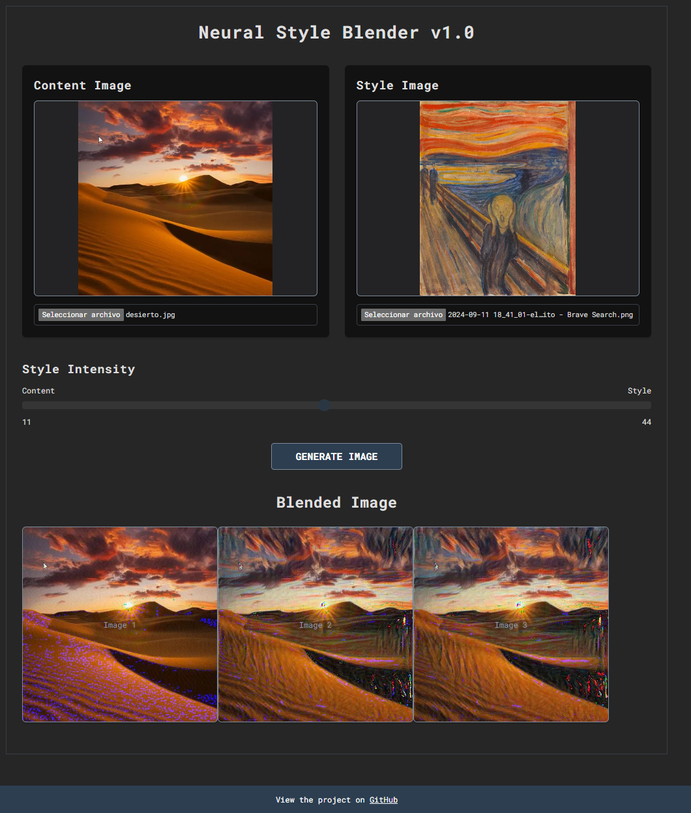

# Neural Style Blender

This project implements Artistic Style Transfer using neural networks. It provides two implementations using different frameworks: PyTorch and TensorFlow. 

## Table of Contents

1. [Introduction](#introduction)
2. [Models and Features](#models-and-features)
3. [Cost Function](#cost-function)
4. [Setup and Installation](#setup-and-installation)
5. [Usage](#usage)
6. [License](#license)

## Introduction



This project is based on the paper ["A Neural Algorithm of Artistic Style"](https://arxiv.org/abs/1508.06576) by Leon A. Gatys, Alexander S. Ecker, and Matthias Bethge. The paper introduces a novel approach to artistic style transfer, where the style of one image can be applied to the content of another using neural networks.

## Models and Features

The project uses the VGG19 model, a pre-trained convolutional neural network, to extract features from images. These features are then used to compute the content and style costs, which guide the optimization process to blend the style of one image with the content of another.

### VGG19 Model

- **Content Layer**: Extracts high-level content features from the image.
- **Style Layers**: Extracts low-level style features from the image using Gram matrices.

## Cost Function

The cost function consists of two main components:

1. **Content Cost**: Measures the difference between the content of the generated image and the content of the reference image. It is computed as:

   $$ J_{content} = \frac{1}{4n_{H}n_{W}n_{C}} \sum_{i,j} (a_{C}[i,j] - a_{G}[i,j])^2 $$

   Where \(a_{C}\) and \(a_{G}\) are the content features of the reference and generated images, respectively.

2. **Style Cost**: Measures the difference between the style of the generated image and the style of the reference image. It is computed as:

   $$ J_{style} = \sum_{l} \frac{1}{4n_{C}^2n_{H}^2n_{W}^2} \sum_{i,j} (G_{S}[i,j] - G_{G}[i,j])^2 $$

   Where \(G_{S}\) and \(G_{G}\) are the Gram matrices of the style features of the reference and generated images, respectively.

The total cost function is a weighted sum of the content and style costs:

$$ J_{total} = \alpha \cdot J_{content} + \beta \cdot J_{style} $$

Where \(\alpha\) and \(\beta\) are hyperparameters that balance the importance of content and style.

## Setup and Installation

To run the project, follow these steps:

1. **Clone the repository:**

   ```bash
   git clone https://github.com/your-username/your-repository.git
   cd your-repository
   ```

2. **Install dependencies:**

   You will need Python 3.8 and the required libraries. You can install them using pip:

   ```bash
   pip install -r requirements.txt
   ```

3. **Download Pre-trained Weights (TensorFlow only):**

   TensorFlow implementation requires VGG19 weights. Download the weights using the link provided in `app_tensorflow.py` or follow the instructions in the TensorFlow documentation.

## Usage

1. **Run the Flask server for PyTorch:**

   ```bash
   python app_pytorch.py
   ```

   This will start a Flask server that serves the PyTorch implementation.

2. **Run the Flask server for TensorFlow:**

   ```bash
   python app_tensorflow.py
   ```

   This will start a Flask server that serves the TensorFlow implementation.

3. **Configure which implementation to use:**

   Edit the `config.yaml` file to select the desired framework (TensorFlow or PyTorch).

## License

This project is licensed under the MIT License - see the [LICENSE](LICENSE) file for details.
